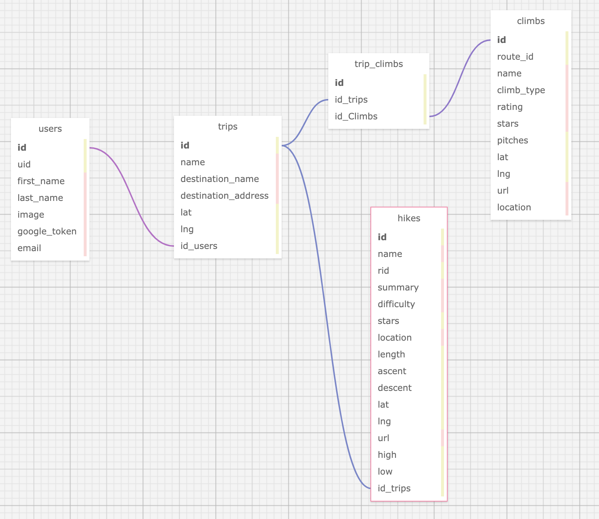

### README

Take a look at Escape's production page at [escape-app](https://escape-app.herokuapp.com/)!

### About Escape

Escape is an interactive application that allows couples and groups to search for climbing and hiking routes near to a destination they are looking to travel to. You start out by signing in with Google, then pick a destination and first activity (climbing or hiking), then you are directed to a page where you can pick your activity's preferences, such as climb difficulty, type of climbing you are looking to do (Trad or Sport) and land on a page that includes your Trip's information and interactive map with all the routes you added to this trip.

### Future Iterations

In future iterations, the dev team is hoping to include campgrounds to trips, as well as mountain biking and running. Including these activities would enhance the user experience, making it a one stop shop for planning the adventurous side of a vacation.

### Purpose Behind the Build

This ten-day group project focused on test-driven and OOP design. It also served as a place to practice the skills we have been learning over the past four weeks including OAuth, consuming and exposing APIs, and dividing monolithic applications into microservices.

### Installation

#### Access Locally

**Clone the Sinatra microservice** with:

`git clone git@github.com:mintona/escape_microservice.git`

`cd escape-microservice`

`bundle install`

`rake db:create`

API Keys Necessary:

[Google Places API](https://developers.google.com/places/web-service/intro)

[Mountain Project API](https://www.mountainproject.com/data)

[Hiking Project API](https://www.hikingproject.com/data)

*Gems Used:*

Production:
* sinatra
* pg
* activerecord
* sinatra-activerecord
* rake
* httparty
* json
* dotenv
* fast_jsonapi
* pry

Testing and Development:
* pry
* rspec
* rspec-core
* rack-test
* capybara
* webmock
* vcr
* shoulda-matchers
* database-cleaner-active-record

**Clone the Rails app** with:

`git clone git@github.com:mintona/escape_app.git`

`cd escape-app`

`bundle install`

`rake db:setup`

Seeds are provided, but you can also create your own!

API Keys Necessary:

[Google Client Id and Google Client Secret](https://console.developers.google.com/cloud-resource-manager)

[Google Maps API](https://developers.google.com/maps/documentation/javascript/get-api-key)

*Gems Used:*

In Production:
* Faraday
* Figaro
* Omniauth Google OAuth2

For Testing and Development:
* Pry
* Capybara
* factory_bot_rails
* launchy
* simplecov
* shoulda-matchers
* vcr
* webmock
* database cleaner active record

### Versions
- Ruby 2.6.3
- Rails 6.0.2.1

### Database and Schema design

### Testing
